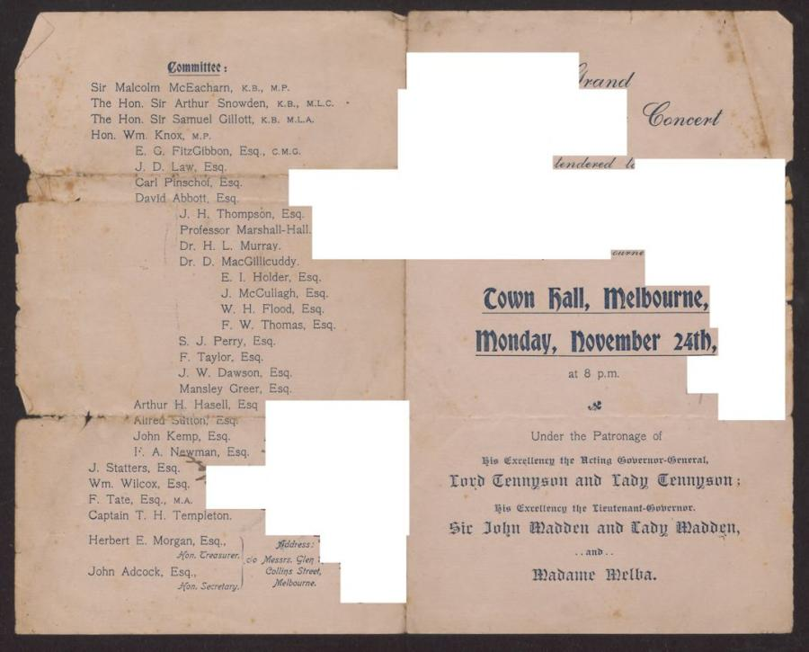
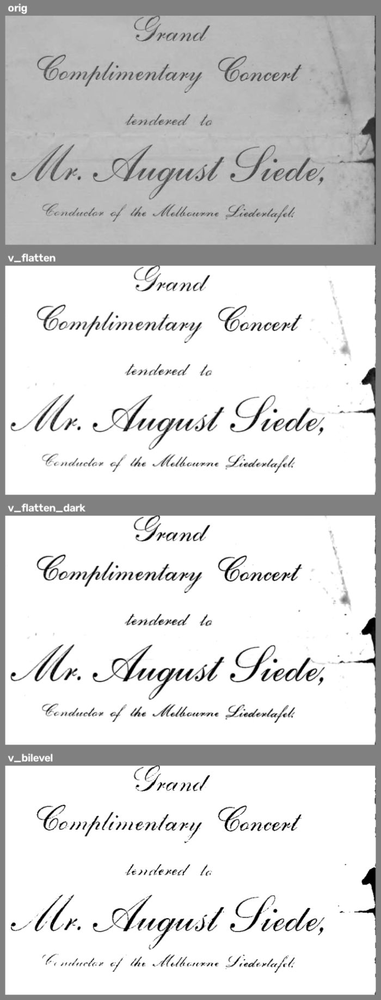
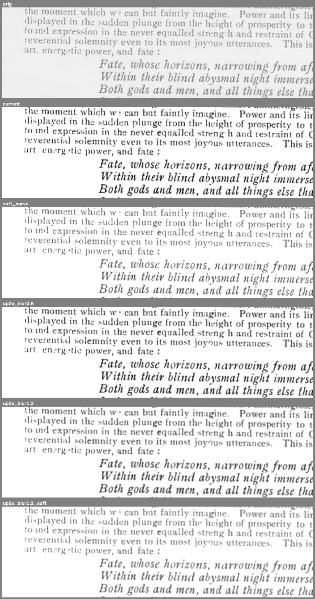
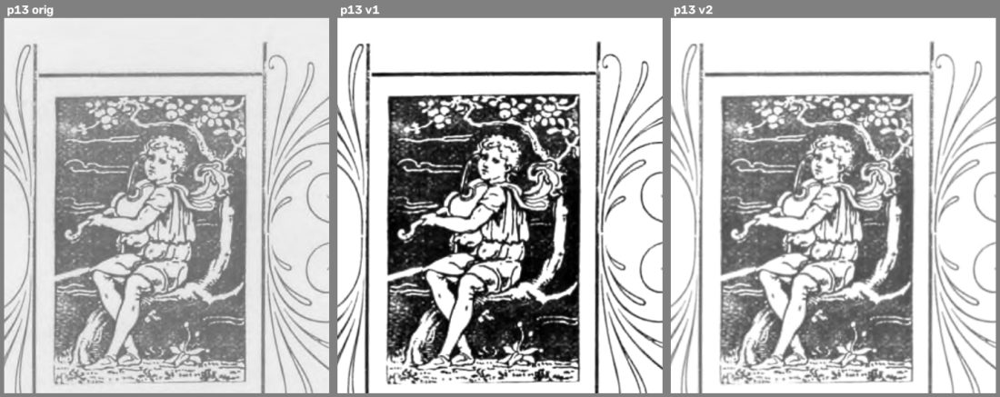
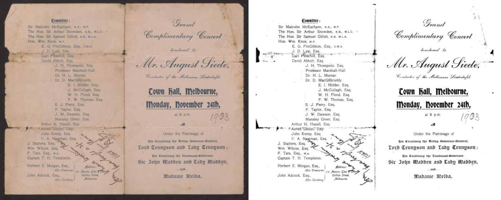
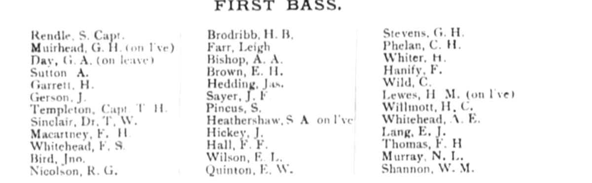
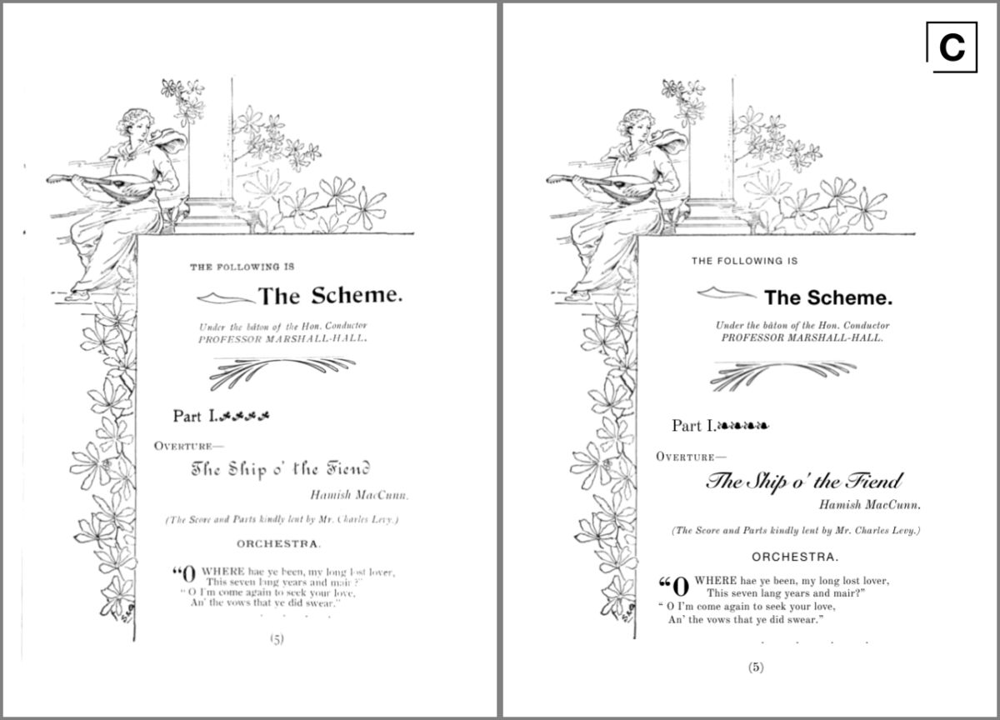
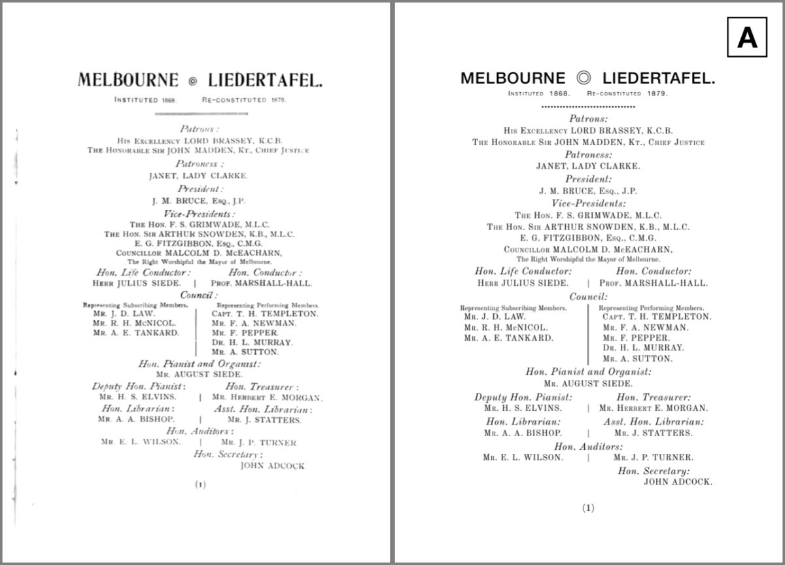

# Preparing the Liedertafel scans for print: how it was done

This note records how two archival PDF scans (UDC20260028-69, a two-page 1902 Melbourne Liedertafel circular and concert card, and UDC20260028-21, a twenty-page programme for the 263rd concert of 23 October 1899) were turned into print-ready black-and-white files, how a five-page selection was labelled, and how that selection was re-set as clean, searchable type. Everything described here is reproducible from the scripts in this repository.

## 1. What the source files actually are

Before touching pixels the PDFs were opened with PyMuPDF to list every page's size, image objects, filters and text content. Two facts shaped everything that followed.

**The scans are mixed-raster PDFs.** Each page has a full-page colour scan at about 200 dpi (JPEG 2000 compressed) with an invisible OCR text layer over it. On several pages the base scan has white holes cut into it, and separate small image patches sit on top carrying the content of those regions: the copperplate "Grand Complimentary Concert... Mr. August Siede" heading, an ink inscription, the date "1903", and printer's ornaments. The page 1 patches use 1-bit stencil masks; the page 2 ornaments are plain rectangles.



*The base scan of UDC20260028-69 page 1 extracted on its own. The white areas are not redactions; they are holes filled by separate overlay images in the PDF.*

At first glance those white rectangles looked like redaction boxes. Rendering the page with all layers composited showed the truth, and it changed the design of the pipeline: any processing had to treat the composited page, not the individual images, or the layers would come out with different tones and visible seams.

**The OCR layer is unusable for transcription.** The embedded text reads, for example, "Wcmbers of the Œ^sir" for "Members of the Choir". It was kept in the print files so they remain searchable, but the later transcription was done by reading the page images directly.

## 2. Contrast enhancement for black-and-white printing

Script: `prep_print.py`. Dependencies: PyMuPDF, OpenCV, NumPy, managed with uv.

### 2.1 The pipeline

For each page the script renders the fully composited page at the base scan's native pixel size, so patches and base are handled as one picture. It then:

1. **Converts to greyscale.**
2. **Estimates the paper tone** with a morphological closing (dilate then erode with a 41 px elliptical kernel) followed by a Gaussian blur of the same radius. Closing removes any dark stroke narrower than the kernel, leaving only paper, so the result is a smooth map of the stained, foxed background.
3. **Divides the image by that estimate**, so the paper becomes uniformly white regardless of stains, fold shadows or uneven lighting, while ink keeps its relative darkness.
4. **Applies a levels curve**: input values at or below the black point map to black, at or above the white point to white, with a gamma of 1.3 to push mid-greys darker. Defaults are black 100, white 235.
5. **Optionally thresholds to pure bilevel.** This was produced as an alternative but not recommended, because thin copperplate strokes and ornaments break up.
6. **Whitens the scanner surround.** The paper is found as the largest bright connected component of the original scan, its convex hull is filled, eroded inward by 8 px to remove the gutter shadow along the binding edge, and everything outside becomes white. Tears and fold damage inside the outline are left visible.



*Top to bottom: original, flattened, flattened with the darker curve, bilevel. The darker curve became the default.*

### 2.2 Writing the result back without losing anything

Rather than building a new PDF, the script overwrites the pixel data of each existing image object in place. The processed composite is written into the base image, and for each overlay patch the matching region is cropped out of the composite and written into that patch at its own dimensions. Only the stream and a few dictionary keys change (filter, colour space, bits per component, width, height), so the stencil masks, page geometry and the OCR text layer all survive untouched. Because the patch pixels now come from the same processed composite as the base beneath them, the seams that appeared when each layer was processed separately disappear.

### 2.3 Dealing with grain

The first print files looked grainy. Zooming in showed the grain was in the source: 200 dpi JPEG 2000 of letterpress with uneven ink, with letter edges already broken. The contrast curve hardened those edges and made the noise more visible. Denoising filters (non-local means, bilateral, median) softened everything without helping the ragged edges.

The fix was to upsample each page two times with cubic interpolation and a light Gaussian blur (sigma 1.2 px) before applying the curve. The edges are rounded rather than hardened, and since printers resolve far more than 200 dpi the result reads as smoother type on paper. The files grew about four times in size (lossless compression); a JPEG option exists for smaller output.



*Original, the first curve, a softer curve, and three upsample-then-curve variants. The 2x with sigma 1.2 became the default.*

### 2.4 Per-page overrides

The print-tuned curve crushed the hatching of the engraving on page 13 of the programme into solid black. The script accepts per-page overrides, so that page uses black 50, gamma 1.0, white 245 while the rest keep the defaults. A `--pages` flag writes a subset directly.



*Original, default curve, softened per-page curve.*

### 2.5 Result



Commands used for the final files:

```
.venv/bin/python prep_print.py UDC20260028-69.pdf -o output/UDC20260028-69_print.pdf --mask-border
.venv/bin/python prep_print.py UDC20260028-21.pdf -o output/UDC20260028-21_print.pdf --mask-border \
    --override "13:black=50,gamma=1.0,white=245"
```

## 3. Labelling the selected pages

Script: `label_pages.py`. A five-page selection from the programme (original pages 3, 5, 7, 10 and 18) was stamped with a boxed capital letter A to E in the top-right corner of each page. The box is a vector rectangle and the letter is real Helvetica Bold type drawn with PyMuPDF, so it stays crisp at any size and does not touch the scan or the text layer.

An earlier version also printed the page's number in the full programme beneath the box. It was dropped because the programme has its own printed folios, "(1)", "(3)" and so on, and a second numbering confused readers. The feature remains available behind a `--source` flag.

## 4. Re-setting the selection as clean type

Sources: `transcription/UDC20260028-21_subset.html`, `transcription/img/`, `transcription/render.py`. Output: `output/UDC20260028-21_print_subset_transcription.pdf`.

### 4.1 Reading the pages

Each page was rendered whole at 130 dpi for layout, then in three overlapping horizontal bands at 260 dpi for reading. The choir roll, set in roughly 6 point type in three columns, was rendered again by voice section at 400 dpi so individual initials could be confirmed.



Transcription decisions: original spelling and abbreviations were kept ("plebian", "Honorable", "(on l've)", the Scots dialect verse); small capitals, italics and letter-spaced headings were marked so they could be reproduced; a short list of names that remain hard to read at any zoom was noted for checking (Robie, Voight, Pincus, Whiter, Denneston, Hanify).

### 4.2 Rebuilding the layout

Each page was written as HTML with CSS at the scan's exact trim size (381 by 551 points). Layout devices were matched one for one: centred office lists, paired headings with a dividing bar, the three-column roll with hairline rules, the justified programme note, and the stepped left-aligned lines of the council notice. The A to E label boxes were reproduced at the same coordinates.

Typefaces were chosen to echo the originals rather than imitate them exactly. Old Standard TT carries the body text and italics, UnifrakturMaguntia the blackletter headings ("Members of the Choir", "(Faust, Part 2, Act 3.)"), Snell Roundhand the copperplate titles, and Helvetica Neue the spaced grotesque headings. Old Standard and Unifraktur were fetched from the Google Fonts repository into `fonts/`; the others are macOS system fonts.

Elements that are pictures rather than type were kept as pictures. The seated musician and the leaf border on the Scheme page, the swash before "The Scheme", the plume ornament, and the "ON" flourish were cropped from the cleaned scan at 300 dpi and placed at their original page coordinates. The L-shaped illustration was split into a top band and a left strip that abut exactly, so text can flow into the space it frames.

### 4.3 Rendering and checking

The HTML was printed to PDF with Chromium through Playwright, which respects the CSS page size and embeds the fonts; the system Chrome's headless mode hung under the sandbox and was abandoned. Each rendered page was placed beside its original at the same scale and compared. Two rounds of adjustment followed: folios were moved into the text flow so they could not collide with content, sizes were tightened on the two dense pages, ornaments were enlarged, and one heading weight was corrected.





The output is real, searchable text with embedded fonts, about a quarter the size of the scan-based file.

## 5. Reproducing the work

```
uv sync
.venv/bin/playwright install chromium

# contrast-enhanced print files
.venv/bin/python prep_print.py UDC20260028-69.pdf -o output/UDC20260028-69_print.pdf --mask-border
.venv/bin/python prep_print.py UDC20260028-21.pdf -o output/UDC20260028-21_print.pdf --mask-border \
    --override "13:black=50,gamma=1.0,white=245"

# a labelled subset
.venv/bin/python prep_print.py UDC20260028-21.pdf -o output/subset.pdf --mask-border --pages 3,5,7,10,18
.venv/bin/python label_pages.py output/subset.pdf -o output/subset_labelled.pdf

# the typeset transcription
.venv/bin/python transcription/render.py transcription/UDC20260028-21_subset.html \
    output/UDC20260028-21_print_subset_transcription.pdf
```

Useful flags on `prep_print.py`: `--mode levels|flatten|bilevel`, `--black`, `--white`, `--gamma`, `--radius`, `--upscale`, `--smooth`, `--border-shrink`, `--jpeg-quality`, `--pages`, `--override`.

## 6. Open points

- The 1902 circular is 10.76 by 8.66 inches, slightly taller than A4 landscape, so it needs scale-to-fit or a resize step before printing. The programme pages are 5.29 by 7.63 inches, a little under A5, and could go two-up on A4 landscape.
- A test print of one dense page (original page 10) is the honest check of the grain treatment; on screen at 100 percent the source resolution still shows.
- The six uncertain choir names above should be checked against another source if they matter.

## 7. A TEI edition with facsimile

Files: `tei/UDC20260028-21.xml` (the edition), `tei/schema/tei_all.rng` and `tei/validate.py` (validation), `tei/facs/` (page images), `tei/viewer_template.html`, `tei/build_viewer.py` and the generated `tei/viewer.html`.

The remaining fifteen pages of the programme were read the same way as the five in the subset, whole at 130 dpi and in halves at 240 dpi, and the whole document was encoded in TEI P5. The header records the source, the transcription policy and a `tagsDecl` whose `rendition` elements define the typographic classes (blackletter, script, small capitals, letter-spacing and so on) as CSS. The `facsimile` section has one `surface` per page with two `graphic` elements, the cleaned print image and the original scan, and every `pb` points to its surface with `facs`. The cover is a `titlePage`; the officers, orchestra and choir are `list` elements, with the source's side-by-side settings recorded as two-column lists of paired offices and as `cb` column breaks at the printed break points in the orchestra and choir rolls, which the viewer lays out as grid columns; the programme is a `div` of parts and items with `lg`/`l` for the sung texts and `xml:lang` on the German and Scots lines; the printer's imprint is in `back`. Ditto marks are kept and expanded with `choice`. The file validates against the TEI Consortium's `tei_all` RelaxNG schema using lxml; three early errors (paragraphs after nested divisions, and `stage` outside drama) were corrected by using `trailer`, `p` and `note` instead.

The viewer is a single HTML file with the TEI and images embedded, so it works from a file system or any static host. It parses the TEI in the browser, walks the `text` element assigning every node to the last `pb` seen, and for each page rebuilds a fragment that keeps only that page's content inside its original ancestors. That is why a stanza split across two pages appears on both with only its own lines. It converts the fragment to HTML element by element, applying the `rendition` CSS read from the file's own `tagsDecl`, and offers the page's TEI source and the full file with syntax colouring, a toggle to show element names, a toggle to expand ditto marks, and a switch between the cleaned and original facsimile.

### 7.1 Text-image linking

Script: `tei/link_zones.py`. Each text-bearing element (verse line, heading, list item, paragraph, byline, note, folio) is given a `facs` pointer to a `zone` on its page's `surface`, with pixel coordinates in the facsimile image. The coordinates come from the scan's OCR layer: its letters are often wrong but its word and line boxes are accurate, so each element's text is fuzzy-matched (difflib sequence ratio, threshold 0.55, or 0.6 for very short strings) against runs of OCR lines, or runs of words within a line for short items on multi-column pages. Long texts are matched first so they claim their words before short ones can, and a line-like element may not match a region taller than two lines. Elements the OCR could not see at all, chiefly the blackletter and copperplate headings, are placed in the vertical gap between their matched neighbours, or hand-placed from measured coordinates when even that fails (the cover title, the orchestra's blackletter section labels, the ornaments), and marked `type="estimated"` or `type="manual"`. The two engravings and the ornaments are `figure` zones. About 555 zones link 553 elements across the twenty pages. In the viewer, hovering text highlights its zone on the facsimile and hovering the facsimile highlights the text; clicking pins the highlight, and a toggle outlines every zone.
